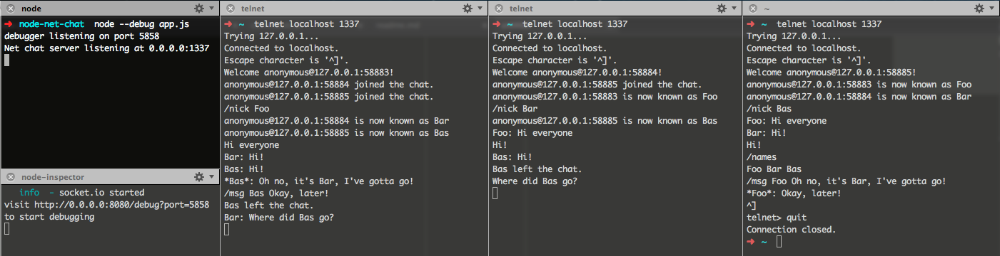

# Node-Net-Chat

A simple 'proof of concept' chat server using the Node.js net module.

It supports a single room and several IRC-ish commands, such as /nick, /names, /msg, and can be easily extended with more.

## Getting Started

node app.js

Start several different telnet sessions and start chatting.

eg) telnet localhost 1337

